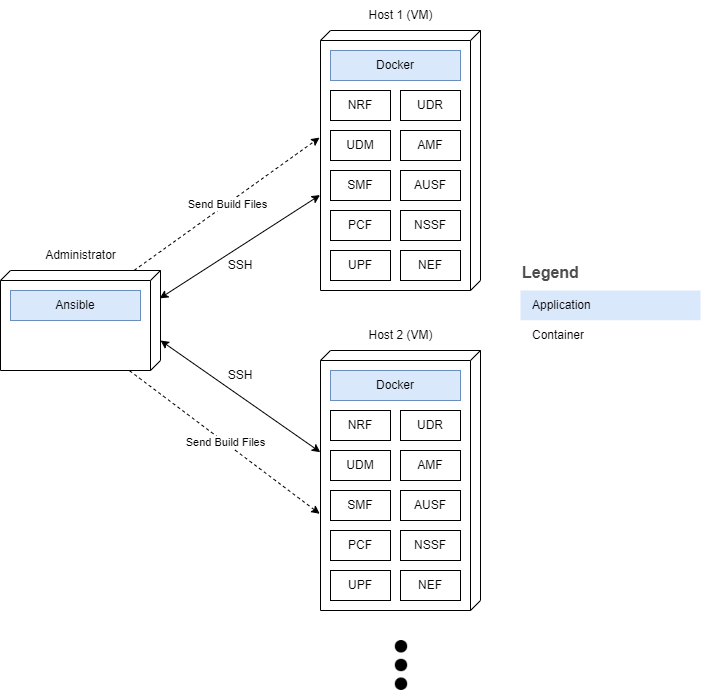

# Documentation
## Containerization and deployment
This tool containerizes the following NFs with base image Ubuntu 16.04 using Docker and deploys them on the specified hosts using Ansible:
- NRF
- UDR
- UDM
- AMF
- SMF
- AUSF
- NSSF
- UPF
- NEF
- PCF
	- AMF
	- NFRS
	- PES
	- OMS
	- IWS
	- SMS

Diagram of the process:

When the playbook is run again, if the latest image is built for a CNF, it is assumed that a container of that image exists and the said container is started again if it is exited. If an inage is removed, the build and run process is repeated for it.

## Status and port testing
After deployment, services of all NFs are checked for activity. Later, the specified ports inside `build-run.sh` are exposed in their respective containers and tested for connection through the host machine using Netcat. The results are shown in a playbook task as a report. If any of the port checks fail, the playbook may give an error which will be ignored. The build files and the report are removed from the host environment when the playbook terminates.

## Environment setup
1. Update your package list with `sudo apt update` and install Ansible to your machine with  `sudo apt install ansible`.
2. Download the repository files through GitHub.
3. Add the necessary host IPs to the `test_servers` group of `test_hosts` inventory along with their SSH and sudo passwords.
4. Run the playbook with `ansible-playbook -i test_hosts playbook.yml`.

Note: It is assumed that the host environment has Docker Engine installed and all repository files and the terminal are in the same directory.